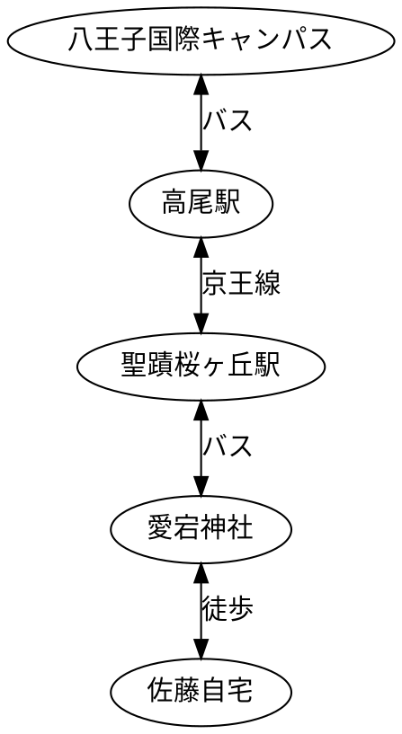

# 佐藤の通学経路

[メンバー表に戻る](member.md#メンバー表)

```graphviz
digraph {
    edge [dir=both]

    八王子国際キャンパス -> 高尾駅 [label=バス]
    高尾駅 -> 聖蹟桜ヶ丘駅 [label=京王線]
    聖蹟桜ヶ丘駅 -> 愛宕神社 [label=バス]
    愛宕神社 -> 佐藤自宅 [label=徒歩]
}
```
